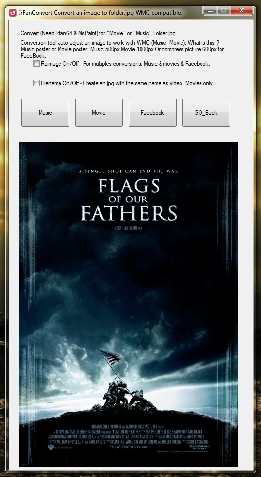

# IrfanConvert-WMC
Need iview450_x64_setup.exe , convert an image to folder.jpg for Windows Media Center. Conversion tool, use with irfan x64 to auto-adjust an image to work with WMC. Use this to convert to lower resolution of a picture. Option to post in facebook with lower uptime with resolution of 100 to 2000 px with default of 600 px.

Select an image to convert for create a poster for movies (1000px) or music (500px) cover compatible with windows media center.

